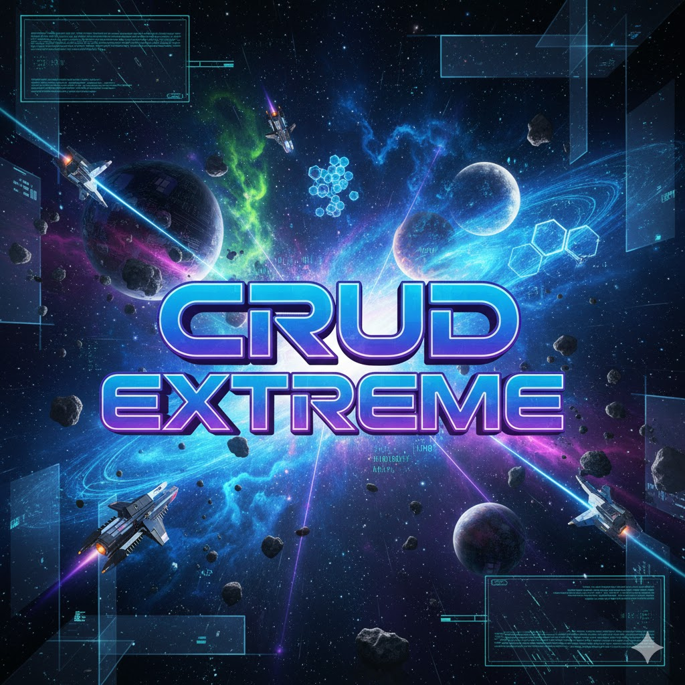

<p align="center">
  
</p>

<h1 align="center">CRUD Extreme — The Ultimate C++ Evolution</h1>

<p align="center">
   From a simple CLI CRUD to a Cloud-Ready, DevOps-driven, AI-powered system.  
  <br>
  Built for learning. Designed for production.
</p>

<p align="center">
  
  
  
  
</p>

---

##  Project Description

CRUD Extreme is a professional-grade evolution of a simple CRUD written in C++.  
It progressively integrates DevOps, Cloud, Security, Monitoring, and AI features —  
until reaching **enterprise-level production standards**.

 Current focus: **Containerization & Runtime automation**  
 Docker integration completed

---

##  Architecture Overview

🔹 Clean and scalable folder structure  
🔹 Modern C++ (RAII, smart pointers, lambdas, patterns)  
🔹 MariaDB with UUID-based primary keys  
🔹 Fully Dockerized and orchestrated

Full technical documentation is available inside **docs/**   
Architectural diagram: `docs/architecture-diagram.png`

---

##  Roadmap — CRUD EXTREME

| Stage | Status | Description |
|------|:----:|-------------|
| **1️⃣ C++ CRUD + MariaDB + DAO Pattern** |  | Functional database CRUD with UUID |
| **2️⃣ Dockerization** |  | Containers ready for production |
| **3️⃣ Kubernetes + Minikube** |  | Deploy inside a real cluster |
| **4️⃣ Security (JWT + Secrets + bcrypt)** |  | Strong authentication and protection |
| **5️⃣ CI/CD with GitHub Actions** |  | Automated builds/tests/deploy |
| **6️⃣ Monitoring (Prometheus + Grafana)** |  | Metrics + observability dashboards |
| **7️⃣ Cloud Deploy (AWS EKS)** |  | Cluster running in the cloud |
| **8️⃣ AI (Password Advisor)** |  | Strength validation & recommendations |
| **9️⃣ Web Dashboard (React + Tailwind)** |  | Full UI consuming REST API |
| **🔟 Enterprise Showcase & Docs** |  | Complete release & case study |

>  *Updated as the project evolves. Stay tuned!*

---

##  Tech Stack

| Category | Technologies |
|---------|--------------|
| Language | C++17 |
| Database | MariaDB 11 |
| Packaging | Docker + Docker Compose |
| Platform | Linux (WSL2) |
| Architecture | DAO, Singleton, Clean Structure |
| ID System | UUIDv4 generator |
| Build Tools | g++, CMake (coming soon) |

---

##  How to Run (Docker)

```bash
# Run complete environment (DB + App)
./scripts/deploy_docker.sh

# In another terminal: access the app menu
docker exec -it crud-app ./crud
